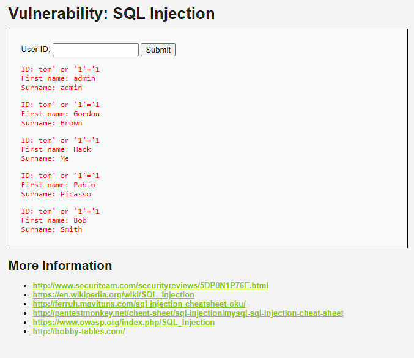

# SQL Injection

SQL injection is a type of cyber attack where an attacker manipulates or inserts malicious SQL code into input fields of a web application. The goal is to exploit vulnerabilities in the application's handling of user input and gain unauthorized access to a database or manipulate its data. By injecting malicious SQL commands, an attacker may retrieve sensitive information, modify data, or perform unauthorized actions within the database. To prevent SQL injection, developers should implement secure coding practices, such as parameterized queries and input validation.

# Attack DVWA:Low LV

In DVWA, the left sidebar provides a SQL Injection tab for testing SQL injection attacks at different security levels. On this page, there is an input field for User ID, allowing users to retrieve data based on a specific user ID.

For this attack scenario, the goal is to extract all user data from the server. The server likely uses a SQL command similar to:
``` sql
SELECT * FROM users WHERE id = 'user_id_input_value';
```

To exploit this, I input user' or '1'='1 into the User ID field and click the submit button. The manipulated SQL command becomes:

``` sql
SELECT * FROM users WHERE id = 'user' or '1' = '1';
```

This causes the SQL query to retrieve all user data because the condition '1' = '1' always evaluates to true, effectively bypassing any legitimate user ID check. The SQL server interprets this as finding users where the ID is either the specified user or '1' equals '1', resulting in all user data being returned from the database.

returns
In this case i use **tom' or '1' = '1**


